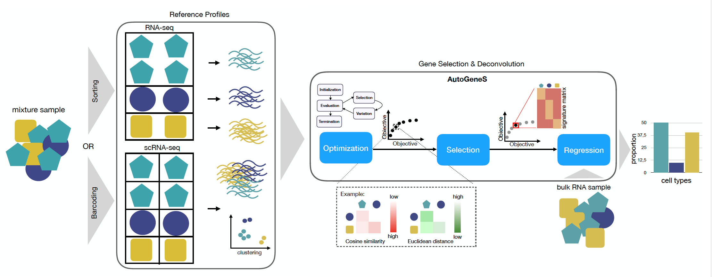

# AutoGeneS

AutoGeneS **automatically** extracts informative genes and reveals the cellular heterogeneity of bulk RNA samples. AutoGeneS requires no prior knowledge about marker genes and selects genes by **simultaneously optimizing multiple criteria**: minimizing the correlation and maximizing the distance between cell types. It can be applied to reference profiles from various sources like single-cell experiments or sorted cell populations.



For a multi-objective optimization problem, there usually exists no single solution that simultaneously optimizes all objectives. In this case, the objective functions are said to be conflicting, and there exists a (possibly infinite) number of **Pareto-optimal solutions**. Pareto-(semi)optimal solutions are a set of all solutions that are not dominated by any other explored solution. Pareto-optimal solutions offer a set of equally good solutions from which to select, depending on the dataset

## Installation

1. <br/> 
```pip install --user autogenes```<br/>
2. <br/>
```git clone https://github.com/theislab/AutoGeneS```<br/>
```pip install --user dist/autogenes-0.9.1-py3-none-any.whl```<br/>

## Documentation

[Documentation](https://autogenes.readthedocs.io/en/latest/)

[Getting Started](https://autogenes.readthedocs.io/en/latest/getting-started.html)

## Dependencies

* python >=3.6
* anndata
* deap
* cachetools
